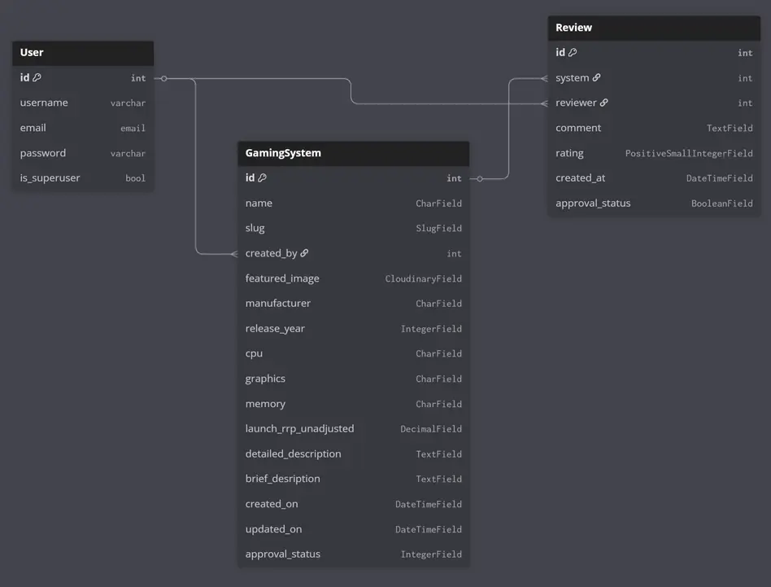

# Spec A Console!

A Django Capstone project

[Link to deployed site](https://spec-a-console-448d20442e38.herokuapp.com/)

[Link to project Github](https://github.com/lratcli/capstone-project)

[Link to project KanBan](https://github.com/users/lratcli/projects/12)

Spec A Console is a fun website whose purpose is to allow people to create and share alternate-history games consoles. It's a chance to re-live playground arguments about what could be, what should be, and what definitely shouldn't be.

Create an account and create a system for others to view or leave a review of.

Mobile example screenshot (actual mobile):

Example of tablet resolution scaling:

Example of desktop resolution scaling:

# Table of Contents

- [User Experience and Design](#user-experience-and-design)
    - [Agile Methodology](#agile-methodology)
        - [User Stories](#user-stories)
        - [MoSCoW Prioritisation](#moscow-prioritisation)
        - [Project KanBan Board](#project-kanban-board)
    - [Entity Relationship Diagram (ERD)](#entity-relationship-diagram-erd)
    - [Wireframes](#wireframes)
    - [Colour](#colour)
    - [Fonts](#fonts)
- [Features](#features)
    - [Admin](#admin)
    - [Navbar](#navbar)
    - [Footer](#footer)
    - [Main page](#main-page)
    - [Create System page](#create-system-page)
    - [System Detailed page](#system-detailed-page)
    - [My Systems](#my-systems)
    - [Create Account](#create-account)
    - [Log In](#log-in)
    - [Log Out](#log-out)
    - [User Notifications](#user-notifications)
- [Technologies Used](#technologies-used)
- [Deployment](#deployment)
- [Testing](#testing)
    - [Manual Testing against User Stories](#manual-testing-against-user-stories)
    - [Code Validation](#code-validation)
    - [Lighthouse Testing](#lighthouse-testing)
- [Bugs](#bugs)
- [Use of AI](#use-of-ai)
- [References and Credits](#references-and-credits)

# User Experience and Design

The site goal is to create a website where people can come and share their ideas on what might have made a good console or not, and others can give feedback on that in the form of a "review". It is important that users can 'own' their systems by posting them from a user account, and that they can modify and also delete any console idea that they have created.

As a layer of protection against misuse, all reveiws must be approved by an administrator after creation or modification before anyone other than the user-creator can see them on the site. Reviews must also be approved before anyone other than the user-creator can see them.

## Agile Methodology ##

In keeping with the principles of **Agile Development**, following ideation User Stories were created and then assigned to appropriate Epics.

The four Epics that User stories are split are:

- Epic: Admin - core administration capability
- Epic: User General - features common to all user activities
- Epic: User Proposed-System - create and view hypothetical gaming systems
- Epic: User Review - attach user created reviews of a hypothetical gaming system to that system

These Epics are represented by labels on respective user stories on the Kanban board.

### User Stories ###

  
Click to expand section

The User Stories created to guide this project, and their respective Epics, are as follows:

**Epic: Admin**

- *Admin full control*: As an admin, I can add, modify, or delete "proposed-systems" and "reviews" associated with regular users, so that I can handle any issues that occur on the site, including after a proposed gaming-system or review has gone live on the site.

- *Admin Content Approval*: As a site admin, I approve "proposed-systems" and their "reviews" before they appear on the site, so that I can maintain the integrity of the site.

**Epic: User General**

- *Create user account*: As a site user, I can create a user account, so I can own my hypothetical systems and reviews of others’.

- *Responsive, mobile first design*: As a site user, I want the site to be responsive across devices, so that I can browse the site on my phone on lunch break, or write a detailed explanation on my laptop or desktop.

- *Dedicated proposed-system pages*: As a site user, I want to be able to read about people’s proposed gaming systems on a page dedicated to that system, so that I can see in detail what ideas other people are coming up with.

- *Home page content*: As a site user, I want to be presented with a collection of the latest fantasy systems on the home page, so I can easily dip into some of the latest content on the site

- *Message Admin*: As a site user with an account, I want to be able to message admin directly, so I can engage them directly from the site as a known user.

**Epic: User Proposed-System**

- *Create hypothetical gaming system*: As a user I want to be able to create my own custom, hypothetical a gaming-system to be displayed on the site, so I can share my ideas or thoughts with others.

- *User-owner edit system*: As a user creating a gaming-system, I want to be able to edit and update my proposed console, so that I can add additional detail or respond to feedback.

- *Delete proposed system*: As a user creating a gaming-system, I want to be able to delete gaming-systems that I no longer wish to propose, so that I can curate my proposed systems and remove ones that no longer feel deserving of a place in my collection

- *Detailed description of proposed gaming system*: As a user creating a gaming-system, I can leave a detailed description and rationale for a system I’ve created, so I can explain or justify my ideas as fully as I wish to.

- *Detail sections for proposed system*: As a user creating a gaming system, I want to have dedicated areas to enter brief details about a system in key categories: CPU, Graphics processor, memory, price, proposed year. This is so that I can quickly get across the idea for the system without readers having to go into a more detailed description first.

- *Proposed-system image*: As a user creating a gaming-system, I want to be able to upload an image representing the system, so I can make my entry on the site unique or distinctive.

**Epic: User Review**

- *User review of others' proposed-systems*: As a user I want to be able to leave reviews or feedback on console ideas, so I can be part of a larger discussion in the community.

- *Review scores*: As a site user, I want to see an average review score along with each proposed system so I can quickly see how my opinion compares to others'

- *Reviewer edit own reviews*: As a user creating creating reviews for other users' systems, I want to be able to modify my reviews, so I can keep my reviews up to date with edits to the system I am reviewing or changes in how I feel about a system.

- *Reviewer delete own reviews*: As a user who has created reviews for other users' systems, I want to be able to fully delete my review data from the database, so I can be sure that my review is no longer attached to a proposed system in any way.

 

### MoSCoW Prioritisation ###

  
Click to expand section

In keeping with the Agile Development approach, Stories were prioritised based on the value they added to the site. These categories were:
- Must Have
- Should Have
- Could Have
- Won't Have

Initially there were no *Won't Have* User Stories as all were deemed to be of some degree of desirability, and at the start of development it seemed that it might potentially be possible to implement all of them.

Towards the end of the project, it was deemed that three user stories that had been **Could Have** were unrealistic in the time left and were changed to **Won't Have**. They were then moved back into the **"Backlog"** column on the KanBan board to indicate that they were not being implemented in this round of development, but that were still desireable for a future iteration.

 

### Project KanBan board ###

  
Click to expand section

The User Stories along with their Epic and MoSCoW catagorisation via labels can be seen on the project KanBan board.

[Link to project KanBan](https://github.com/users/lratcli/projects/12)

This screenshot shows the current state of the KanBan board at the time of finalising the Readme.

 

## Entity Relationship Diagram (ERD) ##

  
Click to expand section

The ERD for the database is as follows:

In addition to the Allauth user account model, there are models for the Gaming System and the Review.

The relationship between User and GamingSystem is one to many, as is User to Review. The relationship between GamingSystem and Review is also one to many, as one instance of GamingSystem can have many reviews.

As this is a Django/PostreSQL project, the GamingSystem and Review models inherit from the Django Model.

The GamingSystem model is used to support full end-user CRUD funtionality.

 

## Wireframes ##

  
Click to expand section

Wireframes for the site design are below. They were initially sketched on paper then recreated using Balsamiq. Wireframes were created for the home page, the detailed page for each system, and for the "create a system" page containing the form used to create a system.

**Home page & My Systems:**

The home page has an almost identical layout to the "My Systems" page, which differs only in some of the text above the listed systems.

**Detailed page for each system:**

**Create a System page:**

 

## Colour ##

  
Click to expand section

In keeping with the theme of the site, the colour scheme chosen was influenced by the first level of a classic video game, Green Hill Zone from Sonic the Hedgehog on the Sega Megadrive.

 

## Fonts ##

  
Click to expand section

The site uses a primary and a seconday font, sourced from Google Fonts. These are Orbitron and Quantico, as they were determined to be be a good fit for retro focused games-system based site, while still offering a high degree of legibility.

 

# Features #

## Admin  ##

The admin panel logon page is reached by appending **/admin/** to the URL for the site.

The site allows for designated administrators to sign in, and from there administer the site using the Django admin panel. Approval of Gaming Systems and Reviews that have been submitted by users (to allow all other users to see them) is done through the admin panel.

To approve a system or review and make it visible to other users (and site visitors who aren't logged in), from the admin home page and under the heading of "Spec_A_Console" go to either "Console systems" or "System reviews" respectively:

Then find and select the system or review to approve (in this case the "QS"):

Then, for Systems, change "Approval" from Submitted to Accepted using the selector, and save...

... or for a review tick the approved box and save.

## Navbar ##

The site features a responsive navbar, that collapses into a hamburger menu at tablet or lower screen sizes.

As a logged in user, navigation options are Home, Create System, My Systems, and Logout.

As a visitor who is not logged in, navigation options are Home, Sign Up, and Login.

## Footer ##

The footer contains contact and social media links, and a "Back to Top" link for easier navigation.

## Main page ##

The main page features brief outlines of the six most recently added and approved gaming systems created by users. When more than six systems are on the site, pagination controls are displayed allowing the user to navigate back through more systems.

## Create System page ##

The Create System page allows a logged in user to create a system using a form. The form fields are:

- Console Name
- Image (optional)
- Manufacturer
- Release Year
- Cpu
- Graphics
- Memory
- Launch rrp unadjusted
- Technical Specifications
- Brief Description

This form allows a user to optionally upload a representative image with the submission, so it can be displayed along with the system details.

Fields for release year and price are validated to ensure year of release is between 1970 and 2025, and that price is not negative.

## System Detailed page ##

The System: Detailed page in a full page focusing on only one of the user submitted systems. It present in full all details that the creator entered on the Create System page. It also shows an average score of reviews from other users.

If the person viewing is also the creator, they have the option to modify or delete their System.

If the user choses to delete their System, they are presented with a delete confirmation modal.

Below the System is a form which allows another logged-in user to review the system. Users can only post one review per system, and the creator cannot review their own creation.

## Edit System page ##

The Edit System page is very similar to the Create System page, with the ability to leave without saving any changes.

The image displayed for the system also be changed by uploading another image. If the image is not changed, the previous image will remain displayed.

Note: there is currently an issue where the name of the current image is not displayed in the "Currently" section under image. The feature does, however, work as intended.

## My Systems ##

Very similar to the the main page, this shows all the systems that a logged in user has created, including ones that are not yet approved. They are displayed in the order of newest to oldest.

Like the main page, this displayed up to six systems, after which pagination controls appear to allow navigation to their older systems.

## Create Account ##

The site has a simple sign up form with an optional email field. The site uses django-allauth.

## Log In ##

The site has a simple login page.

## Log Out ##

The site has a simple logout page.

## User Notifications ##

The site always has the username of the currently logged in user near the top of the page, directly under the navbar. 

The site also features confirmation notifications for key actions, including those involved with data creation, modification and deletion. These notifications are displayed near the top of the screen, directly under the username.

Confirmation notifications appear after:
- Sign In
- Sign Out
- Creating a system
- Editing a system
- Deleting a system
- Creating a review

Additionally, Django validation errors for form submissions are displayed aboved the form after attempting a pressing Submit on the Create System page or Save Changes on the Edit System page.

# Technologies Used

  
Click to expand section

## Core Technologies ##

**Python 3.12** - The primary programming language for development.

**Django 4.2** - The main web framework, providing the MVC architecture, ORM, authentication, admin panel, and form handling.

**Django Allauth** - Handles user registration, authentication, and account management.

**Bootstrap 5** - Used for responsive, mobile-first front-end design and layout.

**HTML5** - For structuring web pages and templates.

**CSS3** - Custom styles, including Google Fonts and color variables

**JavaScript** - Used by Bootstrap

**Cloudinary** - For image hosting, processing, and delivery via CDN.

**pillow 12.0** - Python Imaging Library used for image processing and handling image uploads in Django.

**PostgreSQL** - The production database, managed via Django’s ORM.

**Heroku** - Used for deployment and hosting of the live site.

**Whitenoise 5.3** - For serving of static files directly from the application

## Supporting Tools and Libraries:

**Crispy-Forms** - For improved Django form rendering and styling.

**Google Fonts** - Orbitron and Quantico fonts for a retro-inspired look.

**Git & GitHub** - For version control and project management.

**Lighthouse (Chrome DevTools)** - Used for performance, accessibility, and best practices testing.

 

# Deployment #

  
Click to expand section

The site is deployed to Heroku: [Link to the deployed site](https://spec-a-console-448d20442e38.herokuapp.com/)

In addition to Heroku the site needs a PostgreSQL server and a Cloudinary account. Environment variables for these need to be entered as "Config Vars" in the Heroku project's settings. There are three that must be set:
- CLOUDINARY_URL - the Cloudinary URL for your project
- DATABASE_URL - the database URL
- SECRET_KEY - the Django app's secret key

These keys are not part of the project as it is kept in it's GitHub repo. The CLOUDINARY_URL can be found on your Cloudinary account, the DATABASE_URL should be generated when creating the PostgreSQL server, and the SECRET_KEY is generated by Django. 

To create the Heroku app:

1) Make project or project branch available on GitHub
2) In Heroku create a new Heroku Project:
    - Give it a unique name
    - Select a region (for the currently deployed site this is Europe)
    - Click create
3) In the Heroku app's "Settings" tab:
    - Go to the Config Vars section
    - Select "Reveal Config Vars"
    - Enter the appropriate Key/Value pairs for the three Config vars:
        - CLOUDINARY_URL
        - DATABASE_URL
        - SECRET_KEY
4) In the Heroku app's Resources tab select the Dyno type you wish to use (e.g. Eco Dyno)
5) In the Heroku app's "Deploy" tab:
    - Select "Connect to GitHub"
    - Select the repository - in this case "capstone-project"
    - Select either automatic deploys or manual deploys and chose a branch
6) When deploymment is over select "Open app" to view the site

When the site is deployed users should be able to access the home page, and Super Users/Admins should be able to log onto the Django admin panel by appending **/admin/** to the URL for the site.

 

# Testing #

Manual testing was performed by following each of the implemented user stories and verifying the expected outcomes through direct interaction with the deployed site. 

## Manual Testing against User Stories ##

  
Click to expand section

### Epic: Admin ###

| User story | Required result | Outcome |
|----------|----------|----------|
| Admin full control | Admin accounts can access Django admin panel at [URL]/admin/ | SUCCESS |
| Admin Content Approval | User submitted content not visible to other users until approved by admin in admin panel | SUCCESS |

### Epic: User General ###

| User story | Required result | Outcome |
|----------|----------|----------|
| Create user account | User can create user account with username, password, optional email | SUCCESS |
| Responsive, mobile first design | Site displays and functions correctly across mobile to desktop screen sizes | SUCCESS |
| Dedicated Proposed-System pages | Each user created System has its own page showing the full details of the System, which displays correctly | SUCCESS |
| Home page content | The homepage shows a list of the most recently published fantasy Systems, sorted by publish date (newest first) | SUCCESS
|

### Epic: User Proposed System ###

| User story | Required result | Outcome |
|----------|----------|----------|
| Create hypothetical gaming System | A logged in user can access a "Create System" page with form that submits data representing a Gaming System. Form data is submitted successfully | SUCCESS |
| User-owner edit System | A logged in user who has created a System can select an edit option when viewing the System, which takes them to an edit form. Submitted the edit form updates that System on the database | SUCCESS |
| Delete proposed System | A logged in user who has created a System can permanently delete that System from the site using a Delete button and a confirmation modal | SUCCESS |
| Detailed description of proposed Gaming System | The create form and detailed description page allow for entry and display of very large amounts of text | SUCCESS |
| Detail sections for proposed System | The create System form has specific section for CPU, graphics processor, memory, price and proposed year, which successfully submit data of the correct type into the database | SUCCESS |
| Proposed-System image | A logged in user can upload a representative image of their system when creating it. This image is displayed alongside other System information when the System is shown | SUCCESS |

### Epic: User Review ###

| User story | Required result | Outcome |
|----------|----------|----------|
| User review of others' Proposed-Systems | A logged in user can opt to leave a review of another users System. This is visible to other users when viewing the System. Only one review can be left per user, and a user cannot review their own System | SUCCESS |
| Review scores | A logged in user, when leaving a review, selects a score between 1 - 10. This is used to calculate an average score, which is displayed along with the System in its detailed view | SUCCESS |

 

## Code Validation ##

HTML, CSS and Python were all run through validation tools. 

(No custom Javascript was used in this project, and so there is no testing section for Javascript)

### HTML Validation ###

  
Click to expand section

The W3 Schools validator was used. [https://validator.w3.org/](https://validator.w3.org/)

All pages that could be checked were, with the limitation that the the validator could not check as a logged in user.

All urls put into the validator came back green, with the exception of one that I will detail later.

The only exception was the signup page, where a user creates an account with the site. These errors appear to be caused by due to invalid HTML nesting from Django’s default form rendering, and the code in question is not part of a file I have worked on.

Copilot's desription of this issue is:

"These errors are caused by invalid HTML generated by Django’s default form rendering ({{ form.as_p }}).

Specifically, Django sometimes wraps help text and errors in , but if the help text contains a `<ul><li>`, it results in invalid nesting (block elements inside inline elements), which is not allowed in HTML."

As these are issues caused by Django and outside of the code written for this project, and the author is unsure of how to fix them at this time, they remain present. Testing shows the signup feature of the site to work correctly regardless of these html validation issues.

 

### CSS Validation ###

  
Click to expand section

The W3 School validator for CSS was used. [https://jigsaw.w3.org/css-validator/](https://jigsaw.w3.org/css-validator/)

Validation was successful.

 

### Python Validation ###

  
Click to expand section

Python code was validated through the Code Institute Python Linter. [https://pep8ci.herokuapp.com/](https://pep8ci.herokuapp.com/)

All python files passed the linter with no errors.

Example models.py:

Example views.py:

 

## Lighthouse testing ##

  
Click to expand section

The site was tested at various points during development using Google Chrome Lighthouse.

Performance can be variable, and this is due to a combination of Heroku, Bootstrap and Cloudinary impacting performance. Performance results are generally in the 80's, but have been seen to come down to as low as the high 60s on occasion.

 

# Bugs #

  
Click to expand section

The known Bugs and Issues with the site are as follows:

1) Cloudinary files uploaded by the user when they create a Gaming System are not automatically deleted from Cloudinary storage, when which will accelerate the rate at which Cloudinary storage reaches its capacity. A means of automating the deletion of Cloudinary files is desireable.

2) When editing a Gaming System's details, the name of the existing featured_image that was originally uploaded to cloudinary is not shown. This appears to be due to an issue with the way that Django, Cloudinary, and Crispyforms interact. While the user can still change or retain the featured_image, it would be better to have the name of the existing file shown to the user.

3) On the Signup Registration page there remain HTML validation errors caused by the way Django is generating code for this page "behind the scenes". While the page and the sign up form do operate correctly in terms of the function of the site, it would be preferable to eliminate any and all validation errors even if they come from the way Django is doing things.

 

# Use of AI #

AI - and in particular GitHub Copilot has proven to be very useful throughout the development of this project. The stages and roles it has been involved with include:

- Refining User Stories
- Tracking down documentation and definitions (along with desktop copilot)
- Generating site images including backgrounds and specific images for User Created Systems (this was primarily desktop copilot)
- Quickly generating code, particulary involving Bootstrap
- Assisting with debugging and interpreting error messages
- Generating the first draft of the "Technologies Used" section of this readme from within the project

AI has been involved in some way in most if not all of the steps involved in making this project. It is undoubtedly already key part of modern software development.

# References and Credits #

This project is based on the "I Think Therefore I Blog" project that is part of Code Institutes full-stack web development course.

AI generated code and content is used in this project, and this was trained on the work of many people who it will never be possible to properly acknowledge.

While the Coolors.co website was not used to generate a colour scheme for this project, the site was used to help capture a nice screen capture of the colours chosen.

I would also like to acknowledge the many people at CodeInstitute who's hard work and assistance has made this project possible.